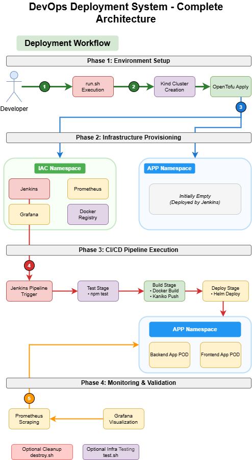
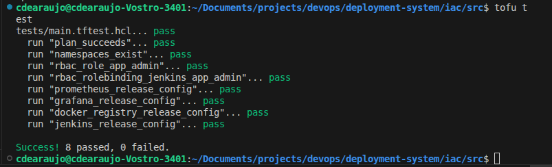

# Deployment System POC

This repository contains a Proof of Concept (POC) for a complete deployment system using Kubernetes, Prometheus, and Grafana to monitor a Node.js application. It demonstrates an end-to-end infrastructure and application deployment with monitoring capabilities.

## Content

- **Infrastructure as Code**: Using OpenTofu (TerraForm alternative) to provision and manage infrastructure
- **Container Orchestration**: Kubernetes deployment using Kind for local development
- **Application Monitoring**: Prometheus metrics collection and Grafana dashboards
- **CI/CD Pipeline**: Jenkins pipeline configuration for automated deployments
- **NodeJS App**: application with health checks and metrics endpoints

## Architecture Overview

```

┌─────────────────┐
│                 │
│   Frontend      │
│  Hosted with    │
│   Node.js App   │
└─────────────────┘
        │
        ▼
┌─────────────────┐     ┌───────────────┐     ┌────────────────┐
│                 │     │               │     │                │
│    Backend      │────▶│  Prometheus   │────▶│    Grafana     │
│  Node.js App    │     │  Metrics      │     │   Dashboards   │
│                 │     │               │     │                │
└─────────────────┘     └───────────────┘     └────────────────┘
         │                                             ▲
         │                                             │
         │                                             │
         ▼                                             │
┌─────────────────┐                          ┌────────────────┐
│                 │                          │                │
│   Kubernetes    │                          │  Automatic     │
│                 │                          │  Dashboard     │
└─────────────────┘                          │  Provisioning  │
                                             │                │
                                             └────────────────┘
```



## Requirements

- OpenTofu (or Terraform)
- Kind
- Docker
- Node.js
- npm

## Startup the cluster, Build the Infrastructure and test

```bash
./run.sh
```

## Manually run the tests whenever you want

```shell
./test.sh
```

## Manually Build the Infrastructure whenever you want

```bash
export OPENTOFU_ENFORCE_GPG_VALIDATION=false
cd iac/src
tofu init
tofu apply
```

This will set up:

- Prometheus for metrics collection
- Grafana for metrics visualization
- Required Kubernetes resources (namespaces, services, etc.)
- There will expose the commands to get user and password for Jenkins and Grafana.
  ```
  grafana_admin_password = "kubectl get secret --namespace iac grafana -o jsonpath='{.data.admin-password}' | base64 --decode"
  jenkins_admin_password = "kubectl get secret --namespace iac jenkins -o jsonpath='{.data.jenkins-admin-password}' | base64 --decode"
  jenkins_admin_user = "kubectl get secret --namespace iac jenkins -o jsonpath='{.data.jenkins-admin-user}' | base64 --decode"
  ```

## Build and Deploy the Application

### By CI/CD

Go to Jenkins and run the pipeline.

### By command line

Run the following commands to build and deploy the application manually.

# Frontend

```bash
cd app/backend
./deploy.sh <build-number>
```

## Accessing the Services

After deployment, you can access:

- Backend application: http://localhost:3000
- Frontend application: http://localhost:8080
- Jenkins CI/CD: http://localhost:30600
- Grafana dashboards: http://localhost:30400
- Prometheus: http://localhost:30300

## Monitoring Features

- Custom application metrics (request counts, response times)
- Node.js runtime metrics (memory, CPU, event loop)
- Auto-provisioned Grafana dashboards
- Real-time monitoring of application health

## CI/CD Pipeline

The included Jenkinsfile demonstrates:

- Building the application
- Running tests
- Building a Docker image
- Deploying to Kubernetes via Helm

## Destroying everything

The following command will destroy the infrastructure and the cluster:

```bash
./destroy.sh
```

## Testing Infrastructure

Infrastructure testing is a critical component of this POC that ensures the reliability and correctness of your deployment.
Here's why we test infrastructure:

### 🔍 **Validation & Verification**

- **Service Availability**: Confirms that all services (Jenkins, Grafana, Prometheus, Docker Registry) are running and accessible
- **Configuration Correctness**: Validates that services are configured with the correct ports, namespaces, and settings
- **Network Connectivity**: Ensures services can communicate with each other and are reachable from your local machine

### 🚀 **Early Problem Detection**

- **Deployment Issues**: Catches problems immediately after infrastructure provisioning
- **Resource Conflicts**: Identifies port conflicts, naming collisions, or resource constraints
- **Dependencies**: Verifies that service dependencies are properly configured (e.g., Grafana can connect to Prometheus)

### 📊 **Automated Quality Assurance**

- **Consistent Validation**: Provides repeatable tests that ensure infrastructure consistency across deployments
- **CI/CD Integration**: Can be integrated into automated pipelines to prevent broken deployments from reaching production
- **Documentation**: Tests serve as living documentation of what should be working in your infrastructure

### 🛡️ **Confidence in Deployment**

- **Production Readiness**: Ensures your local development environment matches production expectations
- **Rollback Decisions**: Failed tests indicate when infrastructure changes should be reverted
- **Team Collaboration**: Provides clear feedback to team members about infrastructure health

## Infrastructure Testing Features

Our `test.sh` script performs **comprehensive tests**:

- **Cluster Connectivity** - Verifies Kind cluster is accessible
- **Node Health** - Ensures all Kubernetes nodes are ready
- **Namespace Validation** - Confirms required namespaces exist
- **Service Deployment** - Validates all Helm releases are deployed successfully
- **Pod Status** - Checks that all pods are running properly
- **Network Services** - Verifies services are exposed on correct NodePorts
- **Endpoint Connectivity** - Tests HTTP accessibility of all services
- **Security Configuration** - Validates RBAC permissions for Jenkins
- **Credential Management** - Retrieves and validates service credentials
- **Service Authentication** - Tests access to protected services
- **Pipeline Configuration** - Validates Jenkins pipeline creation

### Sample of test result output

The testing script provides detailed output, indicating the success or failure of each test case.
Below is a sample output from the test script:




## Demo

<video src="./demo.mp4" controls width="100%"></video>
